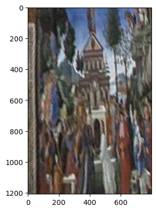

# 📸 Homography Transformation App

Welcome to the Homography Transformation App! 🎉 This app lets you select any four points on an image to create a quadrilateral, then transforms it to a "top-down" view using some serious matrix math. It's a blend of geometry, matrix multiplication, and React/JavaScript, all coming together in a sleek, interactive app powered by FastAPI and React.

## 🎯 What is Homography?

Homography is a transformation that maps points from one plane to another. Imagine taking a picture of a painting at an angle – homography lets us transform it so that it appears as though we're looking at it straight on.

### Why? Because math is awesome! And so is fixing angled images!

This app calculates the **homography matrix** from your selected points, then applies it to make the image appear flat. Think of it like magic, but backed by hardcore matrix calculations.

---

## 🧠 The Math Behind It

Let’s break down the cool math happening here!

1. **Input Points**: You select four points on an image – say a photograph of a document taken at an angle. These points form a quadrilateral.

2. **Homography Matrix Calculation**:
   - Our function, `compute_homography`, creates a 3x3 matrix to map the selected points (source) to a perfect rectangle (destination).
   - This is achieved using the **Direct Linear Transform (DLT)**, which constructs a system of linear equations to solve for the transformation matrix.
   - With Singular Value Decomposition (SVD), we solve these equations to get the homography matrix, `H`.

3. **Applying the Transformation**:
   - Using the computed matrix `H`, we apply the transformation to every pixel in the destination image.
   - This involves reversing the matrix to map each pixel in the output image back to the original image. Then, we use **bilinear interpolation** to estimate the pixel values, resulting in a smoother transformation.

Here's what the math looks like under the hood:

For each destination point `(u, v)`, we find its source coordinates `(x, y)` by:

\[
[x, y, 1]^T = H^{-1} [u, v, 1]^T
\]

where `H` is our homography matrix. This maps the quadrilateral in the original image to a perfect rectangle!

---

## 🚀 Features

- **Image Upload**: Start by uploading an image.
- **Point Selection**: Click four points on the image to form a quadrilateral.
- **Transform**: The app computes the homography matrix and applies it, flattening the image into a top-down view.
- **Dark Mode and Light Mode**: Because we like style!
- **Loading Spinner**: Enjoy a polished experience with a loading spinner while the app processes the transformation.

## 📚 Example Walkthrough

Let’s say you take a photo of a beautiful painting from an angle. You want to "flatten" the painting so it looks like you were directly in front of it. Here’s what you’d do in this app:

1. **Upload the Image**: Choose the photo you took.
2. **Select Four Points**: Click on each corner of the painting. These points tell the app what area you want to flatten.
3. **Transform**: Hit the "Transform" button. The app works its magic (math) and returns a flattened view of the painting!

## 🔧 Code Overview

This app is a FastAPI backend that performs homography transformations and a React frontend that provides an intuitive, interactive UI.

### FastAPI Code (Backend)

The backend processes the image transformation request with the following steps:

1. **Point Ordering**:
   - `order_points(pts)`: Orders the points you clicked in a clockwise manner: top-left, top-right, bottom-right, bottom-left.
   
2. **Homography Matrix Calculation**:
   - `compute_homography(src_pts, dst_pts)`: Computes the homography matrix using the DLT algorithm.

3. **Applying the Transformation**:
   - `apply_homography(img, H, output_width, output_height)`: Maps each point in the output image back to the original using the inverse of the homography matrix and bilinear interpolation to keep it smooth.

4. **Serving the Result**:
   - The transformed image is sent back to the frontend in a hex-encoded format.

### React Code (Frontend)

The frontend is where you select points, upload images, and view transformations. We’ve used Material-UI for styling and React components for interactive UI features like theme toggling, a loading spinner, and a transformation preview.

---

## ⚙️ How to Run the App

### Prerequisites only if you want to run locally the app is dockerised both the front end and the backed

- **Node.js** and **npm**: For the React frontend.
- **Python 3.x**: For the FastAPI backend.
- **Docker** (Optional): If you prefer running everything in Docker containers.

### Running Locally

1. **Docker**: The App is Dockerised running docker so run the command below and you will be grand 
   ```bash
        docker compose up --build --nocache    
   ```

Your app will be accessible at `http://localhost:3000` (frontend) and `http://localhost:8000` (backend).

---

## 📸 Examples




---

## 👩‍💻👨‍💻 Contributing

Found a bug? Want to add new features? We’d love to have you contribute! Please submit a pull request with your changes.

---

## 📜 License

This project is licensed under the MIT License.